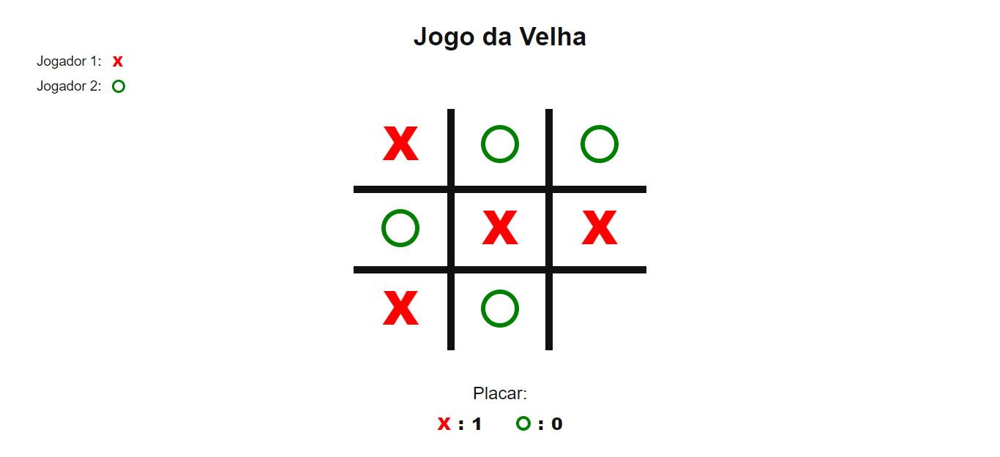

<div align ="center">

# Jogo da Velha - Javascript 

</div>

Esse projeto foi desenvolvido para colocar em prática meus conhecimentos me Javascript moderno

* Demo: [Clique aqui para ver esse projeto](https://leandrorafaeel.github.io/jogodavelha-js/)

<div align="left">
    
</div>

## Tecnologias:
Esse projeto foi desenvolvido com as seguintes tecnologias:

* HTML5
* SASS
* JAVASCRIPT

## Como usar:
Clone o repositório abaixo

```
git clone https://github.com/leandrorafaeel/jogodavelha-js/
``` 

# Autor: 
 

#### Leandro Rafael

[](https://www.linkedin.com/in/leandrorafael-dev/) [](https://twitter.com/leandrorafaelBR) 

## Licença:
[](https://opensource.org/licenses/MIT)

Este projeto está sob licença do MIT. Veja a licença para mais informações:

[Veja o Copyright](https://github.com/leandrorafaeel/jogodavelha-js/blob/master/LICENSE)